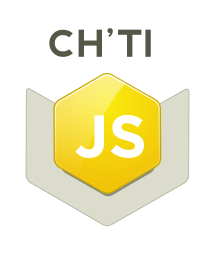
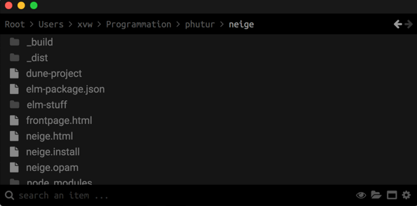
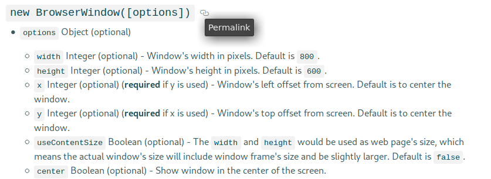

% Liaisons sémantiques de bibliothèques, \newline construire des applications **Electron** en **OCaml**
% {width=100px}

- **xvw** sur Github
- **vdwxv** sur Twitter, **xvw@sunbeam.city** sur Mastodon
- **Margo Bank**, construction d'une banque *from scratch*,
    (On recrute des développeurs *Front-end*)
- **Phutur** : *Useless software with useful languages*
- **LilleFP** : on recherche des speakers

## Objectifs 

> La présentation ne nécéssite pas de connaitre OCaml ou 
> Electron. \newline Ce qui sera dit est applicable dans des langages 
> avec un **système de type expressif** et des **FFI**, comme 
> PureScript, Idris ou Haskell.

### Objectifs 

- Comprendre "ce qu'est un bon *binding*" à mon sens 
- Comprendre des problématiques liés au typage
  (parce que c'est à la mode, **TypeScript**, **Flow**, **HaXe**)

### Hors périmètre 
- Apprendre OCaml ou à écrire des *bindings* OCaml
- Apprendre Electron


## Programme

- Pourquoi **Electron**, pourquoi **OCaml**
- Un bon *binding* 
- **Js\_of\_OCaml** très rapidement
- Exemples de liaison simples
- Problématiques liées au **typage** (la fonction **on**)
- Problématiques liées au **design** (la communication inter-processus, remote), peu de code

## Pourquoi Electron

> Electron consomme beaucoup de RAM et de CPU...

- Je faisais beaucoup de bibliothèques
- **Corolaire** : *"La popularité d'une de mes bibliothèques est inversement proportionnelle à son utilité"*
- J'ai eu envie de faire des *vrais logiciels* pour raisonner d'autres
  aspects du développement (liés à l'**UI** et à l'**UX**)
- **Qian** : de GTK à Electron en passant par Qt...

## Qian 



---

## Et enfait... c'était très amusant à utiliser ^^

### Les plus 
- Très bien documenté
- Très facile à prendre en main 
- Très facile de faire du multi-platforme
- Beaucoup de paquets (NodeJS oblige)

### Les moins
- ~~Consommation mémoire~~
- IMHO, JavaScript
- *Set-up* terrible... Webpack etc.

## Pourquoi OCaml

### Really ?

---

## Pourquoi OCaml

### Really ?

- Langage fonctionnel et impératif moderne (avec un modèle Objet riche)
- Système de types très évolué (Types algébriques, modules)
- Compile (**Js\_Of\_OCaml**), ou transpile (**BuckleScript**) vers JavaScript 
- Et puis j'aime bien !

# Qu'est ce qu'un bon *binding* ?

## Ingrédients

- Couvrir les fonctionnalités majeurs de la source
- Respecter la sémantique du langage cible (au niveau des valeurs)
- Respecter la sémantique du langage cible (au niveau de la structure)

### Implique plus de travail 

- Toute fonction/objet utilisé(e) doit être *emballé(e)*
- Raisonner une correspondance entre les structures (souche - cible)

# Js\_Of\_OCaml (JSOO)\newline le "**of**" est une erreur de traduction historique

## JSOO

- Un **Compilateur** qui convertit le bytecode OCaml en JavaScript
- Avec **une extension de syntaxe** pour distinguer la partie OCaml de la partie JavaScript
- La bibliothèques expose (presque) le runtime JS
- Des outils pour accéder au scope global (et à des bibliothèques externes)

## Compilation


## Entre deux mondes

> Dans un programme JSOO, on est amené à utiliser des 
> valeurs **OCaml** et **JavaScript**.

## Correspondance de types JS <=> OCaml

|**JavaScript**|**OCaml**|
|---|---|
|`int`|`int`|
|`float`|`float`|
|`bool`|`bool Js.t`|
|`string`|`Js.js_string Js.t`|
|`'a array`|`'a Js.js_array Js.t`|
| `('a -> 'b)` | `('a -> 'b) Js.callback`|
| `('a -> 'b)` |  `('a -> 'b, 'c) Js.meth_callback`|

Le type `'a Js.t` est un **type fantôme** qui permet de prévenir 
le compilateur que l'on va se servir de l'objet comme en JavaScript.

## `null` et `undefined` 

- `'a Js.Opt.t` décrit une valeur potentiellement nulle
- `'a Js.Optdef.t` décrit une valeur potentiellement non définie

## Typer des objets complexes

Utilisation d'interfaces, par exemple : 

```ocaml
open Js 
class type point = object 
   method x : int readonly_prop
   method y : int readonly_prop
   method toString : unit -> js_string t meth 
   method translate : int -> int -> point t meth
   method image : domain Js.t -> point t Opt.t meth
   method moveTo : int -> int -> unit meth 
   method moveTo_point : point t -> unit meth
end
```

- Fonctions "**polytypes**" avec l'utilisation d'un underscore

## Syntaxe

| **JavaScript**   | **OCaml**                                        |
|------------------|--------------------------------------------------|
| `foo.bar()`      | `foo ## bar ()`                                  |
| `foo.bar("baz")` | `foo ## bar (Js.string "baz")`                   |
| `foo.bar`        | `foo ##. bar`                                    |
| `foo.bar = true` | `foo ##. bar := Js.bool true`                    |
| `new B()`        | `new%js b()` où `b : (unit -> b Js.t) Js.constr` |

`{foo: 10, bar: "foo"}` 

```ocaml
object%js 
  val foo = 10
  val bar = Js.string "foo"
end
```

## C'est très verbeux

- Pour faire vivre OCaml et JavaScript, JSOO impose des constructions 
  verbeuses (mais nécéssaire)
- C'est aussi compliqué à lire
- **On voudrait cacher le *boilerplate* à l'utilisateur de notre**
  **bibliothèque**
- Ne lui faire manipuler que des valeurs OCaml !
- Faire remonter au plus vite les erreurs de type

# Présentation de cas issus de la bibliothèques **ocamlectron**,\newline beaucoup d'amis trouvent ce nom horrible... 

## Ce qu'on voudrait 

- Limiter au maximum la programmation impérative (la plomberie interne de la bibliothèque)
- Utiliser au maximum les outils de OCaml, dans sa sémantique : 
  - **Snake Case** au lieu de **Camel Case** (aha)
  - Manipuler des valeurs OCaml (`string` au lieu de `Js.js_string Js.t`)
  - Manipuler des types algébriques 
  - Manipuler les modules OCaml
  
## Découpe de la bibliothèque : 

- **OCamlectron.Plumbing** : *Binding low-level* 
- **OCamlectron.Main** : Expose les objets du *main process* 
- **OCamlectron.Render** : Expose les objets des *render processes*
- **OCamlectron.Api** : Api de manipulation des objets *main* et *render*

**Api** permet de manipuler dans tous les processus, 
les objets de tous les processus. (**Obligatoire à cause du Remote**).

# Exemples concrets

# Premier exemple : l'alerte \newline Masquer les chaines de caractères JavaScript

## Un binding naïf 

### Plutôt que : 
```ocaml
let () = Dom_html.window ## alert (Js.string "Mon alerte")
```
### Implémenter : 
```ocaml
module Window = struct 
  let alert message = 
    let message' = Js.string message in 
    Dom_html.window ## alert message' 
end

let () = Window.alert "Mon alerte"
```

# Fixer le domaine de certaines fonctions \newline `application.getPath(path)`

## `get_path_of`

- `application.getPath(path)` : Renvoie le chemin d'un dossier "connu" de l'OS
- **L'ensemble des valeurs valides de `path` est connu**

## On décrit l'ensemble des chemins requêtable

```ocaml
type path_name = 
  | Home 
  | AppData 
  | UserData 
  | Temp 
  | Exe 
  | Module 
  | Desktop 
  | Documents 
  | Downloads 
  | Music 
  | Pictures
  | Videos
  | Logs
  | PepperFlashSystemPlugin
```

## On implémente une fonction de conversion privée 

```ocaml

let path_to_string = function 
  | Home -> "home"
  | AppData -> "appData"
  | UserData ->"userData"
  | Temp -> "temp"
  | Exe -> "exe"
  | Module -> "module"
  | Desktop -> "desktop"
  | Documents -> "documents"
  | Downloads -> "downloads"
  | Music -> "music"
  | Pictures -> "pictures"
  | Videos -> "videos"
  | Logs -> "logs"
  | PepperFlashSystemPlugin -> "pepperFlashSystemPlugin"
```

## On implémente la fonction 

```ocaml
val get_path_of : App.t -> path_name -> string
let get_path_of app path_name = 
  let path = path_to_string path_name in 
  let value = app ## getPath (Js.string path) in 
  Js.to_string value
```

### A utiliser 

```ocaml
let home = App.get_path_of my_app Home
```

# Dealer avec les objets et leurs champs optionnels

## Le constructeur de BrowserWindow



- Pleins de champs optionnels
- Certains champs entretiennent une **interdépendance**

## On défini le type des paramètres 

```ocaml
class type options = object
  method width : int Optdef.t readonly_prop
  method height : int Optdef.t readonly_prop
  method x : int Optdef.t readonly_prop
  method y : int Optdef.t readonly_prop
  method useContentSize : bool t Optdef.t readonly_prop
  method center : bool t Optdef.t readonly_prop
  method minWidth : int Optdef.t readonly_prop
  method minHeight : int Optdef.t readonly_prop
  method maxWidth : int Optdef.t readonly_prop
  method maxHeight : int Optdef.t readonly_prop
  method resizable : bool t Optdef.t readonly_prop
  method movable : bool t Optdef.t readonly_prop
  (* ... *)
  method tabbingIdentifier : js_string t Optdef.t readonly_prop
end
```
## On les projette dans un record 

```ocaml
type options = {
    width : int option
  ; height : int option
  ; x : int option
  ; y : int option
  ; use_content_size : bool option
  ; center : bool option
  ; min_width : int option
  ; min_height : int option
  ; max_width : int option
  ; resizable : bool option
  ; movable : bool option
  (* ... *)
  ; tabbing_identifier : string option
}
```

## On crée un proxy pour le constructeur

```ocaml
let make 
      ?width 
      ?height
      ?position
      ?use_content_size
      ?center
      ?min_width
      ?min_height
      ?max_width
      ?max_height
      ?resizable
      ?movable
      (* .. *)
      ?tabbing_identifier
      constr =  ...
```

## On crée un proxy pour le constructeur 

```ocaml
let options = object%js 
      val width = f id width
      val height = f id height
      val x = f fst position 
      val y = f snd position
      val useContentSize = f Js.bool use_content_size
      val center = f Js.bool center
      val minWidth = f id min_width
      val minHeight = f id min_height
      val maxWidth = f id max_width
      val maxHeight = f id max_height
      val resizable = f Js.bool resizable
      val movable = f Js.bool movable
      (* .. *)
      val tabbingIdentifier = f Js.string tabbing_identifier
  end in new%js constr options
```

## A l'usage 

- Utilisation d'arguments nommés 
- Utilisation de couples pour l'interdépendances

```ocaml
let window = 
    BrowserWindow.make () 
    
let other_window = 
   BrowserWindow.make 
    ~widht:640 
    ~height:480
    ~position:(10, 20)
    ()
    
```

# Un cas plus complexe : les événements de **NodeJS** \newline Impossible à résoudre "proprement" sans ruser

## Le problème 

```javascript
app.on("ready", function(_event) {
  console.log("Application prête");
});

app.on("exit", function(_event, exitCode) {
  console.log("Application terminée :", exitCode);
});
```
## Comment définir le type de `on` 

```ocaml
val on : target -> string -> ??? -> unit
```

- Le type du callback **dépend** de la chaine de caractères

## Utilisation de GADTs

> Un **Tye algébrique généralisé** est, entre autre, une collection 
> de variants indexés par des types : 

```ocaml
type 'habitant t = 
  | Float : float -> float t
  | Int : int -> int t
  
Float 10.23 :: float t 
Int 12 :: int t
```

## Restriction du domaine de la fonction `on`

```ocaml
type event = 
  | Ready 
  | WindowAllClosed 
  | BeforeQuit 
  | WillQuit 
  | Quit 
  | OpenFile 
  | OpenUrl 
  | Activate
```

## Encodage du type du callback dans le constructeur

```ocaml
type _ event = 
  | Ready : (Event.js -> unit) event
  | WindowAllClosed : (Event.js -> unit) event
  | BeforeQuit : (Event.js -> unit) event 
  | WillQuit : (Event.js -> unit) event
  | Quit : (Event.js -> int -> unit) event
  | OpenFile : (Event.js -> Js.js_string Js.t -> unit) event
  | OpenUrl : (Event.js -> Js.js_string Js.t -> unit) event
  | Activate : (Event.js -> bool Js.t -> unit) event

```

## Le type de `on` devient donc : 

```ocaml
val on : target -> ('a -> 'b) event -> ('a -> 'b) -> unit
```
- On connecte le type de l'événement avec le type du callback
- On joue sur le fait que `a -> b -> c` = `(a -> b)-> c`
- Ça peut impliquer quelques règles de typage un peu complexe : 

```ocaml
let ev_to_string : type a. a event -> Js.js_string Js.t = function 
  | Ready -> Js.string "ready"
  | ...
  
```

### Mais, **on** est **typesafe** !

# IPCRender, Remote, etc. \newline on n'est pas au bout des problèmes !

## 

### IPCRender 

- Un canal de communication synchrone ou asynchrone entre *render* et *main*
- Evénements définis par l'utilisateur de la bibliothèque

### Remote
- Proxy du *main* dans le *render*
- Expose toute les fonctions exportées dans *main*

## Profiter des foncteurs applicatifs du langage

**Pas ceux de Haskell**, ceux de OCaml/SML.

**On demande à l'utilisateur de typer les événements et l'objet remote**.

```ocaml
module type T = 
sig
  type _, _ event 
  type remote
end
```

---


## Exemple d'implémentation

```ocaml
module S : T = 
struct
  type _, _ event = 
  | Ping : (`Main, (unit -> unit)) event
  | Pong : (`Render, (unit -> unit)) event 
  | Tick : (`Both, (unit -> unit)) event
  
  type remote = <
    foo : int Js.readonly_prop
  ; bar : unit -> unit Js.meth
  >
end
```

# Conclusion

## 

- **OCamlectron** est une bibliothèque qui **produit** trois bibliothèques
- Elle essayer de respecter au maximum la **sémantique** de OCaml
- Obligation de délayer la fragmentation en modules
- Malgré le dynamisme de JavaScript, OCaml s'en tire pas trop mal

# Fin, questions ? Remarques ? 
